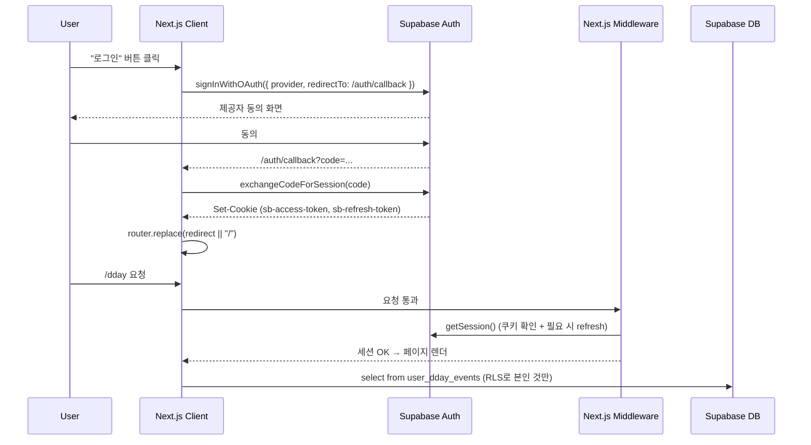

# ggg Auth Spec

> 목적: Supabase Auth 기반 로그인/세션/권한 흐름을 Next.js App Router에서 어떻게 구현할지 고정한다.
> 기준: `MVP-SCOPE.md` §2 · `FRONTEND-ARCHITECTURE.md` · `NAVIGATION-FLOW.md` · `DB-RLS-POLICIES.md`

---

## 1. 요구사항 (Phase 1)

- 비로그인으로도 탐색 플로우(홈/스코어/장소/주변)는 완주 가능.
- 저장성 기능(D-day/북마크/아카이브/구독)은 로그인 필요.
- OAuth: **Google** 우선, **Apple**은 iOS 앱 제출 시 활성 (Phase 1.5).
- 이메일+비밀번호 로그인은 **Phase 1에서는 제공하지 않는다** (비용/보안 단순화).
- 이메일 Magic Link는 보조 옵션 (관리자 계정/내부 테스트용).
- 로그아웃은 어디서나 가능.

---

## 2. 인증 공급자 설정

| Provider | 용도 | 상태 |
|---|---|---|
| Google | 기본 OAuth | Phase 1 필수 |
| Apple | iOS/웹 | Phase 1.5 |
| Email OTP (Magic Link) | 관리자/테스터 | Phase 1 필요 시 |
| Email + Password | — | 미사용 |

Supabase Dashboard → Authentication → Providers에서 활성화. 리디렉트 URL 화이트리스트에 다음 등록:

```
https://<프로덕션 도메인>/auth/callback
https://*.vercel.app/auth/callback
http://localhost:3000/auth/callback
```

---

## 3. 전체 흐름



---

## 4. 클라이언트 구현

### 4-1. Supabase 클라이언트 분리

```
src/lib/supabase/
├── client.ts   # createBrowserClient
├── server.ts   # createServerClient (RSC/Route Handler 용)
└── middleware.ts
```

```ts
// src/lib/supabase/client.ts
import { createBrowserClient } from '@supabase/ssr';

export const supabase = createBrowserClient(
  process.env.NEXT_PUBLIC_SUPABASE_URL!,
  process.env.NEXT_PUBLIC_SUPABASE_ANON_KEY!,
);
```

```ts
// src/lib/supabase/server.ts
import { createServerClient } from '@supabase/ssr';
import { cookies } from 'next/headers';

export function getServerSupabase() {
  const cookieStore = cookies();
  return createServerClient(
    process.env.NEXT_PUBLIC_SUPABASE_URL!,
    process.env.NEXT_PUBLIC_SUPABASE_ANON_KEY!,
    {
      cookies: {
        get: (name) => cookieStore.get(name)?.value,
        set: (name, value, opts) => cookieStore.set({ name, value, ...opts }),
        remove: (name, opts) => cookieStore.set({ name, value: '', ...opts }),
      },
    },
  );
}
```

### 4-2. 로그인 트리거

```ts
// src/features/auth/useLogin.ts
export function useLogin() {
  const search = useSearchParams();
  return async (provider: 'google' | 'apple') => {
    const redirect = search.get('redirect') ?? '/';
    await supabase.auth.signInWithOAuth({
      provider,
      options: {
        redirectTo: `${location.origin}/auth/callback?redirect=${encodeURIComponent(redirect)}`,
        queryParams: { prompt: 'select_account' },
      },
    });
  };
}
```

### 4-3. 콜백 라우트

```ts
// app/auth/callback/route.ts
import { NextResponse } from 'next/server';
import { getServerSupabase } from '@/lib/supabase/server';

export async function GET(request: Request) {
  const url = new URL(request.url);
  const code = url.searchParams.get('code');
  const redirect = url.searchParams.get('redirect') ?? '/';

  if (code) {
    const supabase = getServerSupabase();
    await supabase.auth.exchangeCodeForSession(code);
  }
  return NextResponse.redirect(new URL(redirect, url.origin));
}
```

### 4-4. 미들웨어 (세션 유지)

```ts
// middleware.ts
import { NextResponse, type NextRequest } from 'next/server';
import { createMiddlewareClient } from '@/lib/supabase/middleware';

export async function middleware(req: NextRequest) {
  const res = NextResponse.next();
  const supabase = createMiddlewareClient(req, res);
  await supabase.auth.getSession();   // 쿠키 갱신 부수효과

  const needsAuth = req.nextUrl.pathname.startsWith('/dday')
                 || req.nextUrl.pathname.startsWith('/mypage');
  if (needsAuth) {
    const { data: { session } } = await supabase.auth.getSession();
    if (!session) {
      const url = new URL('/', req.url);
      url.searchParams.set('login', '1');
      url.searchParams.set('redirect', req.nextUrl.pathname + req.nextUrl.search);
      return NextResponse.redirect(url);
    }
  }
  return res;
}

export const config = {
  matcher: ['/((?!_next/static|_next/image|favicon.ico|auth/callback).*)'],
};
```

### 4-5. 클라이언트 훅

```ts
// src/features/auth/useSession.ts
export function useSession() {
  const [session, setSession] = useState<Session | null>(null);
  useEffect(() => {
    supabase.auth.getSession().then(({ data }) => setSession(data.session));
    const { data } = supabase.auth.onAuthStateChange((_e, s) => setSession(s));
    return () => data.subscription.unsubscribe();
  }, []);
  return session;
}

// src/hooks/useRequireAuth.ts
export function useRequireAuth() {
  const session = useSession();
  const router = useRouter();
  const pathname = usePathname();
  useEffect(() => {
    if (session === null) {
      router.replace(`/?login=1&redirect=${encodeURIComponent(pathname)}`);
    }
  }, [session]);
  return session;
}
```

---

## 5. 세션 수명과 토큰

- Access Token: 1시간 (Supabase 기본)
- Refresh Token: 60일 슬라이딩 (프로젝트 설정)
- 쿠키 속성: `Secure; HttpOnly; SameSite=Lax; Path=/`
- 로그아웃: `supabase.auth.signOut()` → 쿠키 삭제 + `queryClient.clear()`

---

## 6. 프로필 구조

Supabase `auth.users`는 수정 권한이 제한되므로 **공개 프로필은 별도 테이블**에서 관리한다 (Phase 1 필수).

```sql
create table public.profiles (
  id uuid primary key references auth.users on delete cascade,
  display_name text,
  avatar_url text,
  created_at timestamptz default now(),
  updated_at timestamptz default now()
);

alter table public.profiles enable row level security;

create policy "profiles self select"
  on profiles for select
  using (id = auth.uid());

create policy "profiles self update"
  on profiles for update
  using (id = auth.uid())
  with check (id = auth.uid());
```

가입 트리거:

```sql
create or replace function public.handle_new_user()
returns trigger language plpgsql security definer
as $$
begin
  insert into public.profiles (id, display_name, avatar_url)
  values (new.id,
          coalesce(new.raw_user_meta_data->>'name', split_part(new.email, '@', 1)),
          new.raw_user_meta_data->>'avatar_url');
  return new;
end$$;

create trigger on_auth_user_created
  after insert on auth.users
  for each row execute procedure public.handle_new_user();
```

---

## 7. 로그인 UX (모달)

- 진입점: `?login=1` 쿼리 또는 저장 버튼 탭.
- 모달 구성:
  - 타이틀: "저장하려면 로그인해 주세요"
  - 제공자 버튼: Google (Apple은 iOS 빌드에서만 활성)
  - 하단: 개인정보 처리방침/이용약관 링크
  - 닫기: `?login` 파라미터 제거 + 원래 화면 유지
- 로그인 성공 후:
  - `redirect` 파라미터가 있으면 해당 경로로 `router.replace`
  - 없으면 현재 경로 유지

---

## 8. 로그아웃

```ts
async function logout() {
  await supabase.auth.signOut();
  useUserStore.getState().reset();
  queryClient.clear();
  router.replace('/');
  track('logout');
}
```

---

## 9. 오류 처리

| 코드 | 상황 | 사용자 메시지 |
|---|---|---|
| `invalid_grant` | 코드 교환 실패 | "다시 로그인해 주세요" |
| `otp_expired` | Magic Link 만료 | "링크가 만료됐어요. 다시 요청해 주세요" |
| 네트워크 실패 | 로그인 요청 중 단절 | "네트워크를 확인한 뒤 다시 시도해 주세요" |
| `PGRST301` (RLS 거부) | 권한 없음 | "해당 데이터에 접근할 수 없어요" |

상세 로그는 Sentry로 전송 (Phase 1.5+).

---

## 10. 보안/개인정보

- OAuth 동의 시 Google의 `email`, `profile` 범위만 요청.
- `raw_user_meta_data`는 UI에 직접 렌더하지 말고 `profiles`를 통해 사용.
- 로컬 스토리지에 토큰을 저장하지 않는다 (쿠키 기반 `@supabase/ssr` 사용).
- CSRF: Supabase SSR의 State 파라미터 검증 기본 동작 유지.
- 회원 탈퇴(Phase 1.5+): `profiles` 카스케이드 삭제 + `user_*` 카스케이드, Supabase Admin API로 `auth.users` 삭제.

---

## 11. 테스트 체크리스트

- [ ] 비로그인에서 `/dday` 접근 시 `/?login=1&redirect=/dday`로 이동
- [ ] 로그인 완료 후 `redirect` 경로로 복귀
- [ ] 새 탭에서도 세션 유지 (쿠키 공유)
- [ ] 1시간 경과 후 access token 자동 refresh
- [ ] 다른 계정으로 재로그인 시 이전 캐시가 비워짐
- [ ] `profiles` 트리거로 행이 1개 생성됨
- [ ] 사용자 A가 사용자 B의 D-day를 조회/수정/삭제 불가
- [ ] 로그아웃 후 보호된 라우트 접근 시 다시 로그인 요구

---

## 12. 연계 문서

- URL/딥링크: `NAVIGATION-FLOW.md`
- 아키텍처: `FRONTEND-ARCHITECTURE.md`
- 상태: `STATE-MANAGEMENT.md`
- RLS: `DB-RLS-POLICIES.md`
- 환경 변수: `ENV-SETUP.md`
