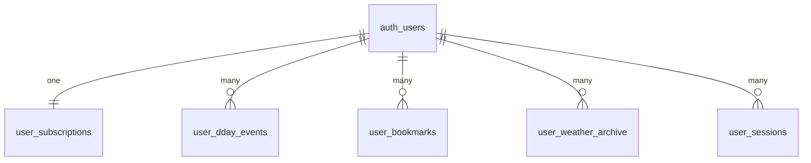
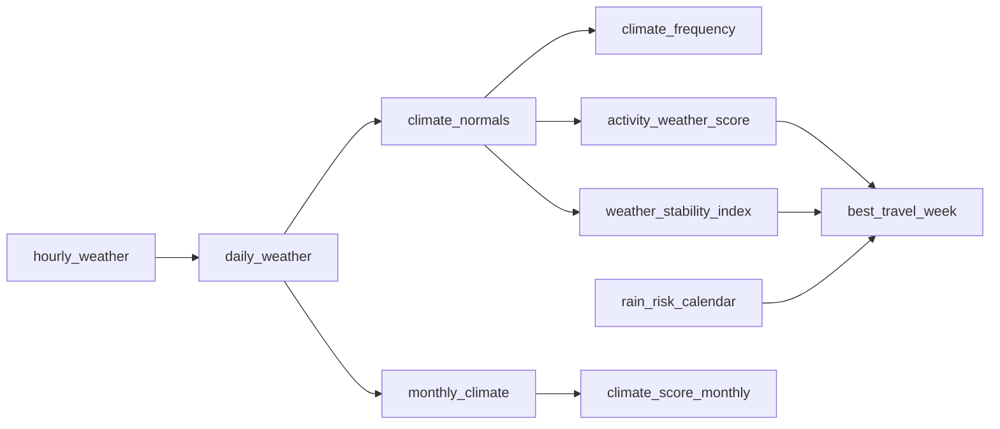

# CLIMATE DB ERD

> 목적: Phase 1 MVP 기준 Supabase 스키마의 엔티티 관계를 한눈에 파악한다.
> 기준: `DB-SCHEMA.md` · `DB-GAP-ANALYSIS.md` · `DB-MIGRATIONS.md`

---

## 1. 도메인 그룹

- **RAW** — 외부에서 적재한 원시 데이터
- **AGG/CLIMATE** — 집계·기후 정규값
- **FORECAST** — 예보 캐시
- **FEATURE** — 서비스 피처 계산 결과
- **UI** — 카드/캐릭터 맵 등 운영 콘텐츠
- **USER** — 사용자 개인화 (Phase 1 P0)

---

## 2. 전체 ERD (mermaid)

```mermaid
erDiagram
  cities ||--o{ hourly_weather        : "has"
  cities ||--o{ daily_weather         : "has"
  cities ||--o{ climate_normals       : "has"
  cities ||--o{ monthly_climate       : "has"
  cities ||--o{ forecast_weather      : "has"
  cities ||--o{ best_travel_week      : "has"
  cities ||--o{ rain_risk_calendar    : "has"
  cities ||--o{ weather_stability_index : "has"
  cities ||--o{ activity_weather_score  : "has"
  cities ||--o{ climate_frequency     : "has"
  cities ||--o{ home_cards            : "references"
  cities ||--o{ nearby_places         : "has"
  cities ||--o{ climate_score_monthly : "has"
  cities ||--o{ hidden_season_highlights : "has"

  auth_users ||--o{ user_dday_events      : "owns"
  auth_users ||--o{ user_sessions         : "owns"
  auth_users ||--|| user_subscriptions    : "owns"
  auth_users ||--o{ user_weather_archive  : "owns"
  auth_users ||--o{ user_bookmarks        : "owns"
  auth_users ||--o{ city_requests         : "submits"

  user_dday_events }o--|| cities : "target_city"
  user_bookmarks   }o--|| cities : "target_city"
  user_weather_archive }o--|| cities : "snapshot_city"

  weather_character_map ||--o{ home_cards : "used_by"

  cities {
    uuid id PK
    text slug UK
    text name_ko
    text name_en
    text station_name
    double lat
    double lng
    text country
  }

  hourly_weather {
    uuid city_id FK
    timestamptz observed_at
    jsonb measures
  }

  daily_weather {
    uuid city_id FK
    date day
    jsonb metrics
  }

  climate_normals {
    uuid city_id FK
    int day_of_year
    jsonb stats
  }

  monthly_climate {
    uuid city_id FK
    int month
    jsonb summary
  }

  forecast_weather {
    uuid city_id FK
    timestamptz forecast_at
    timestamptz valid_from
    timestamptz valid_to
    jsonb payload
  }

  best_travel_week {
    uuid city_id FK
    int year
    int week_of_year
    numeric climate_score
    text score_grade
  }

  rain_risk_calendar {
    uuid city_id FK
    int day_of_year
    numeric p_rain
    numeric p_rain_heavy
  }

  weather_stability_index {
    uuid city_id FK
    int day_of_year
    numeric stability
  }

  activity_weather_score {
    uuid city_id FK
    text activity
    int day_of_year
    numeric score
    numeric kid_safety_score
    numeric golden_hour_score
  }

  climate_frequency {
    uuid city_id FK
    int day_of_year
    text condition
    numeric frequency
  }

  climate_score_monthly {
    uuid city_id FK
    int year
    int month
    numeric score
    text grade
  }

  nearby_places {
    uuid id PK
    uuid city_id FK
    text category
    text name
    double lat
    double lng
    jsonb meta
  }

  hidden_season_highlights {
    uuid id PK
    uuid city_id FK
    int year
    int week_of_year
    text summary
    text status
  }

  weather_character_map {
    int wmo_code PK
    text theme
    text character_asset
  }

  home_cards {
    uuid id PK
    text key UK
    jsonb copy
    jsonb cta
    uuid city_id FK
    int sort
  }

  auth_users {
    uuid id PK
    text email
    timestamptz created_at
  }

  user_dday_events {
    uuid id PK
    uuid user_id FK
    uuid city_id FK
    text title
    date target_date
    jsonb reminders
    text template
    text visibility
  }

  user_sessions {
    uuid id PK
    uuid user_id FK
    text year_month
    int visit_count
    jsonb meta
  }

  user_subscriptions {
    uuid id PK
    uuid user_id FK
    text plan
    text status
    numeric current_price_krw
    timestamptz current_period_end
  }

  user_weather_archive {
    uuid id PK
    uuid user_id FK
    uuid city_id FK
    date observed_on
    jsonb weather
    text note
    text image_url
  }

  user_bookmarks {
    uuid id PK
    uuid user_id FK
    uuid city_id FK
    text target_type
    text target_id
  }

  city_requests {
    uuid id PK
    uuid user_id FK
    text requested_name
    text country
    text status
    timestamptz created_at
  }
```

---

## 3. 핵심 관계 설명

### 3-1. 도시 중심 fan-out
거의 모든 기후/예보/피처 테이블은 `cities.id`를 외래키로 가진다. 도시 삭제는 실질적으로 막히며, 폐기 시 `cities.active = false` 소프트 플래그 사용 권장 (Phase 1.5+).

### 3-2. 사용자 개인화 (USER 그룹)
`auth.users`의 `id`(= `auth_users`로 표기)가 모든 `user_*` 테이블의 owner. RLS 정책으로 본인 데이터만 접근 가능 (상세: `DB-RLS-POLICIES.md`).

### 3-3. D-day ↔ 도시
`user_dday_events.city_id`는 필수는 아니지만 설정 시 해당 도시의 예보/스코어를 상세에서 참조한다.

### 3-4. 구독
`user_subscriptions`는 사용자당 1 row 유지(일대일). 상태 변경 이력은 Phase 1.5+에서 `subscription_history` 테이블 도입 예정.

---

## 4. 단일 사용자 뷰 (프로필 주변)

---

## 5. Feature 계산 의존성

파이프라인 실행 순서는 `DATA-PIPELINE.md`와 `EDGE-FUNCTIONS.md` 참조.

---

## 6. 체크리스트

- [ ] `auth.users` 외 FK는 모두 `on delete restrict` 또는 `on delete cascade` 정책 명시
- [ ] `cities` slug는 unique + 소문자 고정
- [ ] `user_*` 테이블은 모두 RLS 활성화
- [ ] `climate_*` 테이블은 서비스 롤 write, 익명 read 허용
- [ ] 대용량 테이블(`hourly_weather`, `daily_weather`)은 파티셔닝/아카이브 정책 Phase 1.5+ 검토

---

## 7. 연계 문서

- 컬럼 상세: `DB-SCHEMA.md`
- 신규/누락: `DB-GAP-ANALYSIS.md`
- 마이그레이션: `DB-MIGRATIONS.md`
- RLS: `DB-RLS-POLICIES.md`
- 파이프라인: `DATA-PIPELINE.md` · `EDGE-FUNCTIONS.md`
