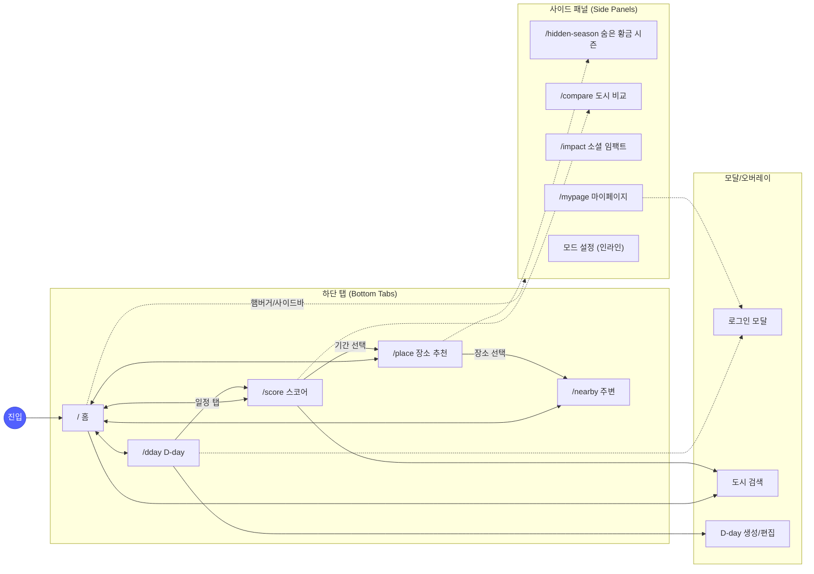
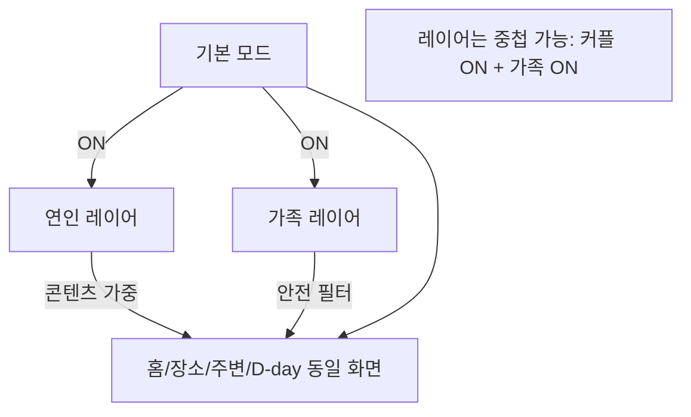
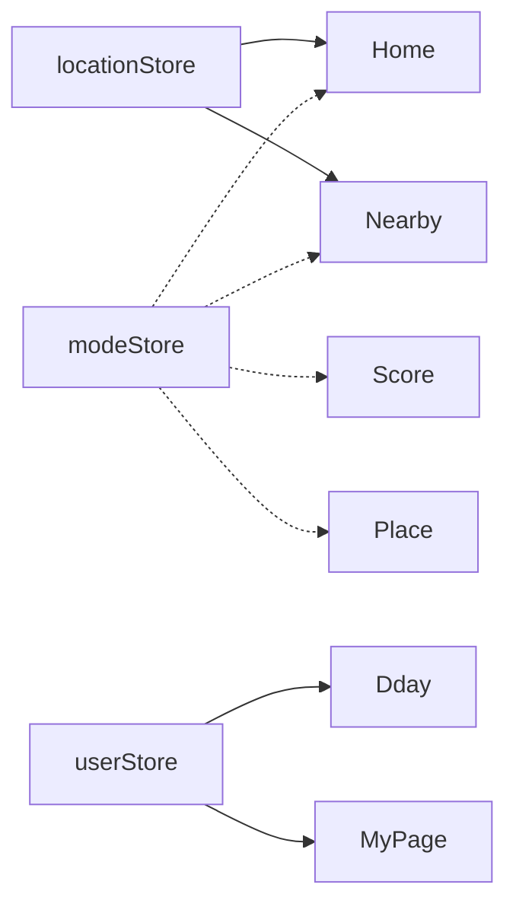

# CLIMATE Information Architecture

> 목적: 하단 탭 5 × 사이드 패널 5 × 모드 레이어의 화면 이동 구조를 한눈에 고정한다.
> 기준: `PRD.md` §4 · `SCREEN-SPEC.md` · `MVP-SCOPE.md`

---

## 1. 전체 IA 맵



---

## 2. 탐색 계층

### 2-1. 계층 구조

```
Root Layout
├── TabLayout (모바일: 하단탭 · 태블릿/PC: 사이드바)
│   ├── 홈 /
│   ├── 스코어 /score
│   ├── 장소 추천 /place
│   ├── 주변 /nearby
│   └── D-day /dday   (로그인 필요)
│
├── SidePanel (모바일: 햄버거 슬라이드 · PC: 사이드바 상단)
│   ├── 숨은 황금 시즌 /hidden-season
│   ├── 도시 비교 /compare
│   ├── 소셜 임팩트 /impact
│   ├── 마이페이지 /mypage   (로그인 필요)
│   └── 모드 설정 (인라인, 별도 라우트 없음)
│
└── Overlays
    ├── 로그인 모달 (쿼리 파라미터 ?login=1)
    ├── 도시 검색 드로어 (?city=search)
    └── D-day 에디터 (/dday/new, /dday/:id/edit)
```

### 2-2. 레이아웃별 네비게이션 노출

| 뷰포트 | 하단 탭 | 사이드바 | 모드 토글 위치 |
|---|---|---|---|
| Mobile (≤767px) | 고정 노출 5탭 | 햄버거 메뉴 드로어 | 상단 앱바 or 드로어 |
| Tablet (768~1023) | 숨김 | 좌측 72px 아이콘 | 상단 앱바 |
| Desktop (≥1024) | 숨김 | 좌측 240px 풀 라벨 | 상단 앱바 (세그먼트 컨트롤) |

---

## 3. 모드 레이어 구조

모드는 **독립 화면이 아니다**. 기본 모드 위에 연인/가족 레이어를 ON/OFF한다 (`PRD.md` §4-0).



적용되는 화면과 변화:

| 화면 | 기본 | + 연인 ON | + 가족 ON |
|---|---|---|---|
| 홈 | 현재/예보/5일 | + 골든아워 배지 | + KidSafetyScore 배지 |
| 스코어 | Climate Score | + 골든아워 품질 점수 | + 어린이 안전 지수 |
| 장소 추천 | 기후 기반 상위 | 로맨틱/일몰 가중 | 안전/실내 우선 |
| 주변 | 거리·카테고리 | 포토스팟/야경 우선 | 키즈카페/실내 우선 |

---

## 4. 화면 간 핵심 이동 패턴

### 4-1. 탐색 플로우 (비로그인 가능)

```
홈
└─ (도시 검색) → 스코어 → (기간 선택) → 장소 추천 → (장소 선택) → 주변/상세
```

### 4-2. 저장 플로우 (로그인 진입점)

```
스코어 (기간 선택)
└─ [D-day 저장] 버튼
   └─ 비로그인이면 로그인 모달
      └─ 로그인 성공
         └─ D-day 편집 오버레이 열림
            └─ 저장 → /dday 목록
```

### 4-3. 재방문 플로우 (알림 기반)

```
푸시 알림 (D-30/D-7/D-1)
└─ 딥링크 /dday/:id
   └─ D-day 상세 (예보 + 스코어 업데이트)
      └─ "장소 재확인" → /place?period=...
```

### 4-4. 사이드 패널 진입

```
어디서든
└─ 햄버거 (모바일) / 사이드바 (PC)
   └─ 숨은 황금 시즌 | 도시 비교 | 소셜 임팩트 | 마이페이지 | 모드 설정
```

---

## 5. 뒤로가기 정책

- 하단 탭 간 이동: 브라우저 히스토리 stack 유지 (뒤로가기로 이전 탭 복귀 가능)
- 모달/오버레이: 쿼리 파라미터 해제로 닫힘 (뒤로가기 = 닫기)
- 딥링크 진입 후 뒤로가기: 홈(`/`)으로 fallback

상세 정책은 `NAVIGATION-FLOW.md` §5 참조.

---

## 6. 접근 제어 요약

| 화면 | 비로그인 가능 | 비고 |
|---|---|---|
| 홈, 스코어, 장소 추천, 주변 | ✅ | 저장만 차단 |
| 숨은 황금 시즌, 도시 비교, 소셜 임팩트 | ✅ | 전체 공개 |
| D-day, 마이페이지 | ❌ | 진입 시 로그인 모달 |
| 모드 설정 (인라인) | ✅ | 로컬 저장 → 로그인 시 서버 동기화 |

쓰기 동작(`user_*` 테이블):
- `user_dday_events` · `user_bookmarks` · `user_weather_archive` · `user_subscriptions` → 모두 로그인 필요

---

## 7. 데이터/상태 의존성 매핑



상세: `STATE-MANAGEMENT.md`.

---

## 8. 연계 문서

- 화면별 데이터/상태: `SCREEN-SPEC.md`
- 라우팅/딥링크: `NAVIGATION-FLOW.md`
- 페르소나 여정: `USER-JOURNEY.md`
- 컴포넌트 구성: `COMPONENT-SPEC.md`
